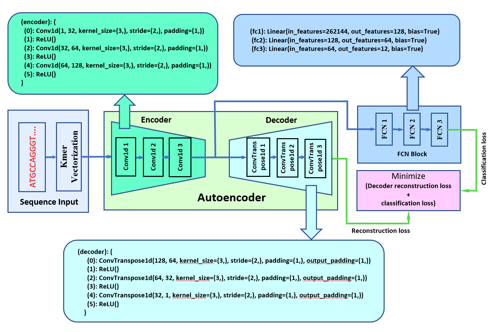
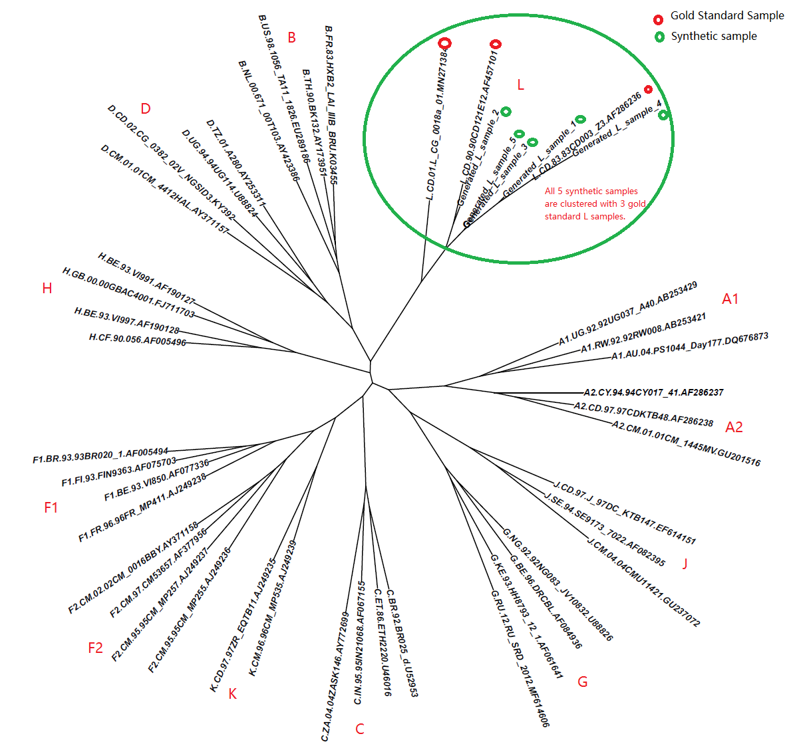
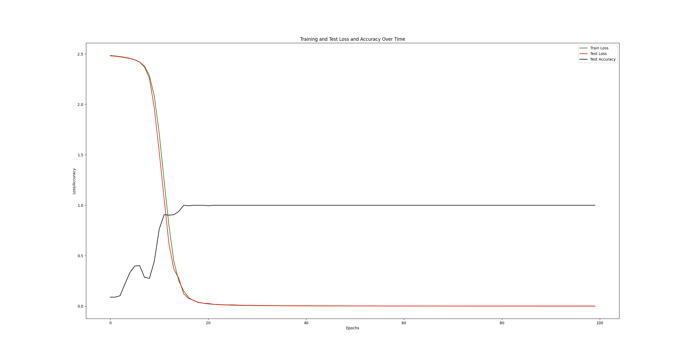

# HIV-1-M-SPBEnv  
The Human Immunodeficiency Virus, also known as HIV, is a retrovirus that causes deficiencies in the human immune system. This virus attacks and gradually destroys the human immune system, leaving the host unprotected during infection. People who are infected with HIV and pass away often die from secondary infections or cancer. AIDS is the final stage of HIV infection.

There are two main types of the AIDS virus: HIV-1 and HIV-2. HIV-1 originated in the area around the Congo Basin in Africa and is the most prevalent strain globally. It is responsible for about 95% of all HIV infections. HIV-2 is primarily found in West Africa, although it also affects a small number of people in Europe, India, and the United States.

HIV-1 can be divided into 4 groups: M, N, O and P, and Group M is the most widely distributed worldwide, which is divided into 12 different subtypes or sub-subtypes, namely A1, A2, B, C, D, F1, F2, G, H, J, K, and L. The formation of various subtypes or sub-subtypes of HIV-1 group M is the result of continuous molecular evolution. Correct classification of subtypes or sub-subtypes is important for vaccine design, therapeutic drugs, and effective prevention and control of AIDS in the global community.

Precise M subtype or sub-subtype classification relies on phylogenetic analysis of specific gene sequences. In the past, subtypes were roughly determined through homologous searches in the NCBI database. The accuracy depended on the searcher's judgment level, and sometimes even the correct judgment could not be made. Classification of HIV-1 subtype based on statistical modeling methods has also been developed, but due to the small sample size of some subtypes, this has caused great limitations in the tools derived from statistical modeling. Therefore, we developed a deep learning-based method, which we named HIV-1-M-SPBEnv.  

To address the issue of samples being scarce for some subtypes, we successfully used artificial genetic mutation methods to synthesize new machine learning samples, thereby cleverly solving the problem of insufficient samples for some subtypes.

Due to the rapid evolution rate of the env gene, we chose to model the env gene sequence samples for the classification of HIV-1 subtypes. We download env gene sequences at the HIV Sequence Database supported by Los Alamos National Laboratory ([https://www.hiv.lanl.gov/content/index](https://www.hiv.lanl.gov/content/sequence/HIV/mainpage.html)). We downloaded the 2021 version of the env gene sequence, which is the latest version so far, with a total sample size of 5,310 (Table 1).    
  
In our deep learning model framework, we use the Kmer method to vectorize DNA sequences; we use a three-layer dilated convolution module to initially extract features of the DNA sequence. Then, we use an Autoencoder to further extract high-dimensional feature information of the env gene sequence, supplemented by an Self Attention mechanism to extract features from the encoder output, and finally, we use a three-layer fully connected layer to classify the 12 subtypes. For the complete model architecture and main parameters, please see Figure1.

Using an independent validation dataset, the accuracy of HIV-1-M-SPBEnv reached 100%, demonstrating strong model generalization capabilities. The trained model is deployed at http://www.peng-lab.org:5000/.    
## 1. Requirements
Python == 3.9.18    
torch == 2.1.0+cu121  
torchvision ==  0.16.0+cu121  
scikit-learn == 1.3.2  
pandas == 2.1.2  
numpy == 1.24.1  
matplotlib == 3.8.0  
biopython == 1.79  

## 2. Dependencies can be installed using the following command:
conda create -n HIV-1-M-SPBEnv python=3.9.18  
conda activate HIV-1-M-SPBEnv  

pip install -r requirements.txt  

## 3. Model architecture of HIV-1-M-SPBEnv deep learning classifier  
  
**Figure 1.** An illustration of HIV-1-M-SPBEnv architecture.      
## 4. Genetic operations for generating new env gene sequence samples
We adopted artificial molecular evolution methods for DNA sequence sample synthesis, including synonymous mutation, non-synonymous mutation, insertion mutation, deletion mutation and large fragment recombination.  
## 5　How can we prove that our synthetic samples are reliable? 　　
We randomly selected 5 L synthetic samples from the 500 synthesized L samples, and jointly constructed a phylogenetic tree with 42 gold standard samples of 12 subtypes of HIV type 1. The results show (Figure 2) that the synthesized L samples and the gold standard L sample were completely clustered together. On the other hand, we will use synthetic samples and original samples together to form training samples for training to obtain a deep learning model. Finally, we use an independent test data set to verify our results again.　  
    
**Figure 2.** Marked in green are the 5 synthetic L samples clustered together with the L samples in the gold standard (in red), showing that the synthetic samples are potential L samples.    
## 6. Model training and model evaluation 
The input data set is a fasta format file "HIV_12-class-new" generated by the above five genetic operations. You run the following commands and the model training and model evaluation processes can be performed.   

    cd ./HIV-1-M-SPBEnv  
    python main.py  

## 7. Results
HIV-1-M-SPBEnv was trained by using the original dataset (Table 1) plus the synthetic dataset (Table 2).  HIV-1-M-SPBEnv's classifcation accuracy was 100% for the independent dataset (Table 3). Figure 3 shows the loss function curve during training.  
   
**Figure 3.** Curve of loss functions and test accuracy for 100 epochs.    
## 8. Model deployment
We deployed a trained model on a dedicated server, which is publicly available at:  
http://www.peng-lab.org:5000/analysis, to make it easy for biomedical researcher to perform HIV 1 subtype classification in their research.  
Users can upload their env gene sequences of HIV to the server, and then they can quickly obtain the predicted results of the HIV 1 subtype classification.   
## 9. The data sets
### 9.1 The original dataset
The detailed composition of the DNA sequence data of HIV env gene is shown in Table 1. For this data set, the sample size of some subtypes is too small, and there are only 2-5 samples in 4 subtypes. It is obviously impossible to build a machine learning model on such data. Then the only way is to find ways to increase the sample size for the small sample size subtypes.  
### 9.2 The synthetic dataset
We adopted molecular evolution methods for DNA sequence sample synthesis, including synonymous mutation, non-synonymous mutation, insertion mutation, deletion mutation and env gene large fragment recombination. Synthetic data samples are included in both the model training dataset (Table 2) and the model evaluation dataset (Table 3).    
#### Table 1 The original data set of the 12 subtypes of HIV env DNA sequences.
| Subtype |Sample Size | Subtype |Sample Size |
|-------|---------|-------|---------|
| A1 | 311 | F2 |16 |
| A2 | 5 | G |136 |
| B | 2,887 | H |10 |
| C | 1,717 | J |5 |
| D | 145 | K |2|
| F1 | 73 | L |3 |
### 9.3 The Training dataset
#### Table 2 The training data set for model training after data synthesis.  
| Subtype |Sample Size | Subtype |Sample Size |
|-------|---------|-------|---------|
| A1 | 500 (300)* | F2 |500 (12) |
| A2 | 500 (4) | G |500 (120) |
| B | 500 (500) | H |500 (8) |
| C | 500 (500) | J |500 (4) |
| D | 500 (120) | K |500 (1)|
| F1 | 500 (60) | L |500 (2) |  

#### * 500 (300): The number in bracket is the original sample data. In this case the sample size of synthetic data set is 500-300=200.  
### 9.4 The independent evaluation dataset
#### Table 3 The Independent testing data set for model evaluation＊.
| Subtype |Sample Size | Subtype |Sample Size |
|-------|---------|-------|---------|
| A1 | 11 | F2 |4 |
| A2 | 1 | G |16 |
| B | 2,387 | H |2 |
| C | 1,217 | J |1 |
| D | 25 | K |1|
| F1 | 13 | L |1 |

＊All the independent testting dataset is from the original dataset.    
## 10. Citation
Sihua Peng, Ming Zhang. HIV-1-M-SPBEnv: Type 1 HIV/AIDS 12 subtype prediction based on Autoencoder network with self-attention and a new DNA sequence data augmentation strategy. (Manuscript to be submitted)  
## 11. Contact
If you have any questions, please feel free to contact Sihua Peng (Email: Sihua.Peng@uga.edu) or Ming Zhang (Email: mzhang01@uga.edu).    

Pull requests are highly welcomed!  
## 12. Acknowledgments  
Thanks to Sapelo2 high performance cluster of the University of Georgia for providing computing infrastructure.  
Thanks to Dr. José F. Cordero and Dr. Justin Bahl for their guidance and help during project implementation and paper writing.  
