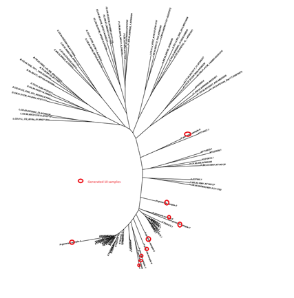
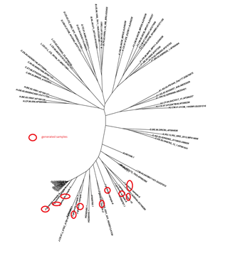

# HIV-SPBEnv

HIV-SPBEnv is a project for HIV 1 subtype classification.
The detailed composition of the DNA sequence data of HIV env gene is shown in Table 1.
### Table 1 The original data set of the 12 subtypes of HIV env DNA sequences.
| Subtype |Sample Size | Subtype |Sample Size |
|-------|---------|-------|---------|
| A1 | 311 | F2 |16 |
| A2 | 5 | G |136 |
| B | 2,887 | H |10 |
| C | 1,717 | J |5 |
| D | 145 | K |2|
| F1 | 73 | L |3 |

