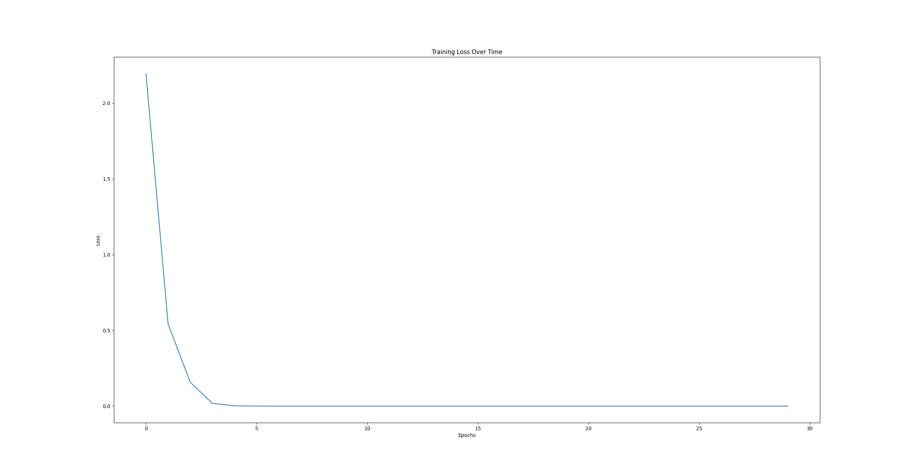

# HIV-SPBEnv  
HIV-SPBEnv is a project for HIV 1 subtype classification.  
## 1. Requirements
Python == 3.9.18    
torch == 2.1.0+cu121  
torchvision ==  0.16.0+cu121  
scikit-learn == 1.3.2  
pandas == 2.1.2  
numpy == 1.24.1  
matplotlib == 3.8.0  
biopython == 1.79  

## 2. Dependencies can be installed using the following command:
conda create -n HIV-SPBEnv python=3.9.18  
conda activate HIV-SPBEnv  

pip install -r requirements.txt  

## 3. Model architecture of HIV-SPBEnv deep learning classifier  
  
Figure 1. An illustration of HIV-SPBEnv architecture. The CNN module contains four CNN blocks, with each CNN block consisting of two CNN layers. The BiLSTM module consists of two BiLSTM layers. The FCN module consists of four fully connected neural network layers.  
## 4. Genetc operations for mutated env gene samples
### 4.1 obtain the deletion mutation
    cd ./HIV-SPBEnv  
    python deletion of amino_acid_sequences_final.py 
### 4.2 obtain the insertion mutation
    cd ./HIV-SPBEnv  
    python insertion_of_amino_acid_sequences_final.py 
### 4.3 obtain the nonsynonymous mutation
    cd ./HIV-SPBEnv  
    python nonsynonymous_mutations_final.py 
### 4.4 obtain the synonymous mutation
    cd ./HIV-SPBEnv  
    python synonymous_mutations_batch_final.py 
### 4.5 obtain the recombination mutation
Before performing the recombination operation, the sequence in fasta format should be multple-aligned by a Multiple Sequence Alignment softwae such as MUSCLE.  　　

    cd ./HIV-SPBEnv  
    python generate_sample_by_recombination_batch_final.py
### 4.６　How can we prove that our synthetic samples are reliable? 　　
By combining synthetic samples and gold standard classification samples to make an evolutionary tree, we can prove from one aspect that our data is credible. On the other hand, we will use synthetic samples and original samples together to form training samples for training to obtain a deep learning model. Finally, we use an independent test data set to verify our results again.　  
    
**Figure 2.** Marked in red are the 10 synthesized H samples clustered together with the H samples in the gold standard, showing that the synthetic samples are potential H samples.  
## 5. Model training and model evaluation 
The input data set is a fasta format file "HIV_12-class-new" generated by the above five genetic operations. You run the following commands and the model training and model evaluation processes can be performed.   

    cd ./HIV-SPBEnv  
    python SPBEnv_Conv_Autoencoder_Attention_final.py  

## 6. Results
HIV-SPBEnv was trained by using the original dataset (Table 1) plus the synthetic dataset (Table 2).  HIV-SPBEnv's classifcation accuracy was 100% for the independent dataset (Table 3). Figure 3 shows the loss function curve during training.  
   
Figure 3 Loss function curve during training for 30 epochs.    
## 7. Model deployment
We deployed a trained model on a dedicated server, which is publicly available at:  
http://www.peng-lab.org:5000/analysis, to make it easy for biomedical researcher to perform HIV 1 subtype classification in their research.  
Users can upload their env gene sequences of HIV to the server, and then they can quickly obtain the predicted results of the HIV 1 subtype classification.   
## 8. The data sets
### 8.1 The original dataset
The detailed composition of the DNA sequence data of HIV env gene is shown in Table 1. For this data set, the sample size of some subtypes is too small, and there are only 2-5 samples in 4 subtypes. It is obviously impossible to build a machine learning model on such data. Then the only way is to find ways to increase the sample size for the small sample size subtypes.  
### 8.2 The synthetic dataset
We adopted molecular evolution methods for DNA sequence sample synthesis, including synonymous mutation, non-synonymous mutation, insertion mutation, deletion mutation and env gene large fragment recombination. Synthetic data samples are included in both the model training dataset (Table 2) and the model evaluation dataset (Table 3).    
#### Table 1 The original data set of the 12 subtypes of HIV env DNA sequences.
| Subtype |Sample Size | Subtype |Sample Size |
|-------|---------|-------|---------|
| A1 | 311 | F2 |16 |
| A2 | 5 | G |136 |
| B | 2,887 | H |10 |
| C | 1,717 | J |5 |
| D | 145 | K |2|
| F1 | 73 | L |3 |
### 8.3 The Training dataset
#### Table 2 The training data set for model training after data synthesis.  
| Subtype |Sample Size | Subtype |Sample Size |
|-------|---------|-------|---------|
| A1 | 500 (300)* | F2 |500 (10) |
| A2 | 500 (4) | G |500 (120) |
| B | 500 (500) | H |500 (8) |
| C | 500 (500) | J |500 (4) |
| D | 500 (120) | K |500 (1)|
| F1 | 500 (60) | L |500 (2) |
#### * 500 (300): The number in bracket is the original sample data. In this case the sample size of synthetic data set is 500-300=200.  
### 8.4 The evaluation dataset
#### Table 3 The Independent testing data set for model evaluation.
| Subtype |Sample Size | Subtype |Sample Size |
|-------|---------|-------|---------|
| A1 | 100 (11)** | F2 |100 (6) |
| A2 | 100 (1) | G |100 (16) |
| B | 100 (100) | H |100 (2) |
| C | 100 (100) | J |100 (1) |
| D | 100 (25) | K |100 (1)|
| F1 | 100 (13) | L |100 (1) |
#### ** 100 (11): The number in bracket is the original sample data. In this case the sample size of synthetic data set is 100-11=89.  
## 9. Citation
Sihua Peng, Ming Zhang. HIV-SPBEnv: Type 1 HIV/AIDS 12 subtype prediction based on Autoencoder network with self-attention and a new DNA sequence data augmentation strategy. (Manuscript to be submitted)  
## 10. Contact
If you have any questions, please feel free to contact Sihua Peng (Email: Sihua.Peng@uga.edu) or Ming Zhang (Email: mzhang01@uga.edu).    

Pull requests are highly welcomed!  
## 11. Acknowledgments  
Thanks to Sapelo2 high performance cluster of the University of Georgia for providing computing infrastructure.  
Thanks to Dr. José F. Cordero and Dr. Justin Bahl for their guidance and help during project implementation and paper writing.  
